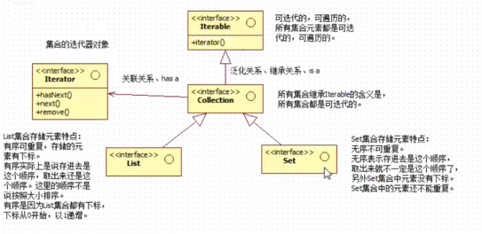

# 1、集合概述
## 1.1 什么是集合，有什么作用？
数组本省就是一个集合，集合实际上就是一个容器，可以对数据进行进行容纳，集合在开发中为什么使用的次数比较多？
集合实际上一个载体，可以一次容纳多个对象；
实际开发中，会在数据库中获取到 10 条数据，查询结束后，通过容器放到浏览器上面进行显示操作；
数据封装成为 10 个对象之后，然后将 10 个对象放到某一个集合中间去，将集合传递到前端，然后遍历集合，然后将数据展示出来；
## 1.2 集合中不能直接存储基本数据类型，另外集合也不能直接存储 Java 对象，集合中存储的是Java对象 的内存地址（集合中存储的是引用）
注意：集合在Java中本身是一个容器，是一个对象，集合中任何时候存储的都是一个引用；
## 1.3 在Java 中的每一个不同的集合，底层对应的不同的数据结构，向着不同的集合中存储元素，等于将数据放置到不同的数据结构当中
什么是数据结构？
数据存储的结构就是数据结构，不同的数据结构，存储的方式是不同的，比如：
    数组
    二叉树
    链表
    哈希表
上面都是常见的数据结构；
使用了不同的集合相当于使用了不同的数据结构；
Java中常用的数据结构已经实现，需要掌握怎么使用即可，在什么情况下选择什么样的数据结构；
new 不同的对象，就是不同的数据结构，直接调用相关的方法即可；
## 1.4 集合在Java中的什么包中？
java.util.*

## 1.5 集合的继承结构图熟记，可以快速开发

集合的整个体系是什么样的？
使用了 UML 进行描述
## 1.6 Java中的额集合的分类
单个方式存储元素java.util.Collection

使用键值对的方式进行存储 java.util.Map

所有的集合因为继承了Iterable 的含义是：所有的集合都是可以迭代的；

## 1.7 在集合中的额部分实现类
ArrayList       底层是数组
LinkedList      底层是双向链表
Vector          底层是数组，线程安全，但是使用的比较少
HashSet         底层是 HashMap,放到 HashSet 集合中元素，相当于放到 HashMap com.基础课程代码练习.集合 key 元素
TreeSet         底层是 TreeMap 放到 TreeSet 中的元素等同于放到 TreeMap com.基础课程代码练习.集合 key 部分
HashMap         底层是哈希表
Hashtable       底层是哈希表，线程安全，效率较低，使用的较少
Properties      线程安全，只能 key value 只能存储字符串 String
TreeMap         底层是二叉树，TreeMap 集合的 key 可以自动按照大小进行排序

## 1.8 List Set Sorted 比较
List 存储元素的特点：
有顺序可以重复，存进去的顺序，取出来的顺序相同

Set 存储元素的特点：
无序，不可重复，存进去的顺序和取出来的顺序是同的，不一定相同；
存入了 1 ，不能继续存储 1 了；

SortedSet 存储元素的特点：
无顺序，不可以重复的，但是 SortedSet 中的元素是可以排序的；
可排序：可以按照大小进行排序；

Map 集合的 key 部分就是一个 Set com.基础课程代码练习.集合
在 Set 集合中存放的数据，实际上是放到了 Map 集合的 key 部分；

# 1.9 韩顺平讲课中的集合知识点
1 集合分为两组（单列集合 双列集合）
2 Collection 下面的 List 以及 Set 存储的只是一个数值
3 Map 存储的是 key value 的形式